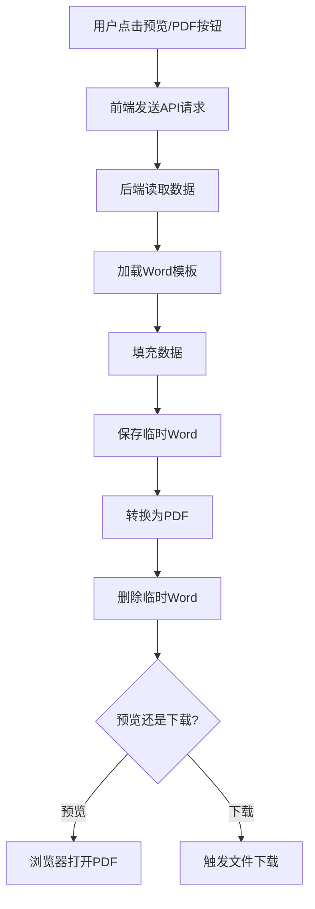

# PDF 生成功能说明

## 📋 功能概述

系统支持将授权书数据直接生成为PDF文档，提供预览和下载功能。

## 🎯 功能特点

### 1. **预览PDF**
- 点击 "预览" 按钮
- 在新窗口/标签页中打开PDF
- 可直接在浏览器中查看
- 无需下载到本地

### 2. **导出PDF**
- 点击 "PDF" 按钮
- 自动下载PDF文件到本地
- 文件名格式：`授权平台_店铺名称.pdf`

### 3. **生成Word**
- 点击 "Word" 按钮
- 下载Word格式的授权书
- 可以进一步编辑

## 🔧 技术实现

### 依赖库

```bash
pip install python-docx
pip install docx2pdf
```

已添加到 `requirements.txt`：
- `python-docx==1.1.2` - Word文档处理
- `docx2pdf==0.1.8` - Word转PDF

### 转换流程

1. 从数据库读取数据
2. 使用Word模板填充数据
3. 生成临时Word文档
4. 将Word文档转换为PDF
5. 删除临时Word文档
6. 返回PDF文件路径

### 文件命名规则

**PDF文件名：** `授权平台_店铺名称.pdf`

例如：`天猫_XXX官方旗舰店.pdf`

## 📂 文件存储

所有生成的PDF文件存储在配置的输出目录：

```python
# config.py
UPLOAD_FOLDER_SHOUQUAN = os.path.join(basedir, 'app/static/generated_docs')
```

## 🌐 API接口

### 1. 生成PDF

```
POST /upload-generated/api/generate-pdf/<id>
```

**响应：**
```json
{
  "success": true,
  "message": "PDF生成成功",
  "file_path": "static/generated_docs/天猫_XXX店.pdf",
  "filename": "天猫_XXX店.pdf"
}
```

### 2. 预览PDF

```
GET /upload-generated/preview-pdf/<filename>
```

- 在浏览器中打开PDF
- `as_attachment=False` 实现预览而非下载

### 3. 下载PDF

```
GET /upload-generated/download-pdf/<filename>
```

- 下载PDF文件
- `as_attachment=True` 触发下载

## 💻 使用示例

### 前端调用

```javascript
// 预览PDF
async function previewPDF(id) {
  const res = await fetch(`/upload-generated/api/generate-pdf/${id}`, {
    method: 'POST'
  });
  const data = await res.json();
  
  if (data.success) {
    // 在新窗口打开预览
    window.open(`/upload-generated/preview-pdf/${data.filename}`, '_blank');
  }
}

// 导出PDF
async function exportPDF(id) {
  const res = await fetch(`/upload-generated/api/generate-pdf/${id}`, {
    method: 'POST'
  });
  const data = await res.json();
  
  if (data.success) {
    // 触发下载
    window.location.href = `/upload-generated/download-pdf/${data.filename}`;
  }
}
```

### Python调用

```python
from app.utils.pdf_generator import generate_pdf_document
from app.models.generated import Generated

# 生成PDF
record = Generated.query.get(1)
success, result = generate_pdf_document(record)

if success:
    print(f"PDF生成成功：{result}")
else:
    print(f"生成失败：{result}")
```

## 🎨 UI按钮说明

在数据列表页面，每行的操作列包含三个按钮：

1. **Word** (蓝色) - 生成并下载Word文档
2. **预览** (绿色) - 在浏览器中预览PDF
3. **PDF** (红色) - 导出并下载PDF文档

## ⚠️ 注意事项

### 1. **依赖要求**

**Windows系统：**
- 需要安装 Microsoft Word
- `docx2pdf` 库使用 COM 自动化调用 Word 进行转换

**Linux/Mac系统：**
- 可能需要其他转换工具（如 LibreOffice）
- 或使用其他PDF生成库（如 reportlab）

### 2. **性能考虑**

- PDF转换需要一定时间（几秒钟）
- 建议使用后台任务处理大批量转换
- 转换过程会创建临时Word文件

### 3. **文件清理**

- 临时Word文件会自动删除
- PDF文件保留在输出目录
- 需定期清理旧的PDF文件

### 4. **错误处理**

常见错误及解决方案：

```python
# 缺少依赖
"系统缺少 docx2pdf 依赖"
解决：pip install docx2pdf

# Word未安装（Windows）
"转换失败：找不到Word应用程序"
解决：安装 Microsoft Word

# 模板文件不存在
"未找到模板文件"
解决：检查模板文件路径和名称
```

## 🔄 工作流程



## 📊 对比：Word vs PDF

| 特性 | Word | PDF |
|------|------|-----|
| 可编辑 | ✅ 是 | ❌ 否 |
| 格式固定 | ❌ 可能变化 | ✅ 完全固定 |
| 浏览器预览 | ❌ 需插件 | ✅ 原生支持 |
| 文件大小 | 较小 | 较大 |
| 打印效果 | 可能变化 | 完全一致 |
| 用途 | 需要编辑 | 最终版本 |

## 🚀 未来优化

1. **异步生成**
   - 使用 Celery 或其他任务队列
   - 大批量生成时提高性能

2. **缓存机制**
   - 相同数据不重复生成
   - 减少服务器负载

3. **跨平台支持**
   - 支持 Linux 系统
   - 使用 LibreOffice 或 unoconv

4. **批量操作**
   - 支持批量生成PDF
   - 打包下载多个PDF

5. **水印功能**
   - 添加企业水印
   - 防止文档盗用

---

**最后更新时间：** 2025-03-16  
**版本：** 1.0.0

